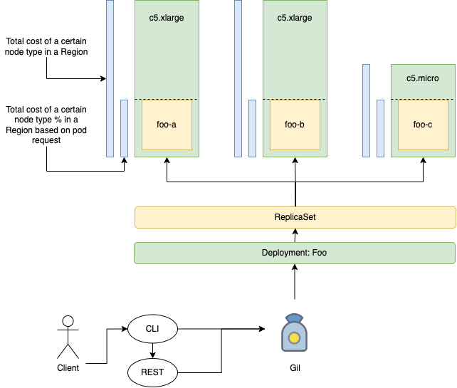

# Gil

<p align="center">
  
</p>


## Command Line Interface

```
./gil price \
    --namespace $my-namespace \
    -l key1=value1 \
    # the region where the prices base will be fetch (price could differ from region to region)
    --region sa-east-1 \
    # where to include associated pods from a deployment along with it's individual cost
    --show-pods | jq
```

## Limitations

Due to lack of `go routines` this application will not scale well when fetching resources within a particular cluster. For now the best way possible to use the binary is to reduce the search scope with a granular `--label-selector`.

You can also compose a bash command to help with scraping:

```
NAMESPACE=foo
for l in $(kubectl get deployment -n $NAMESPACE --show-labels --no-headers | awk '{print $6}' | cut -d ',' -f2); do 
  ./gil price -n $NAMESPACE -l $l --show-pods | jq
done
```

Also, the `--label-selector` must be unique. If you try to search resources with shared selectors such as `squad=mysquad` or `env=prod` we won't know the parent deployment from a given pod when fetching them. For now, we are not backtracking "pod -> replicaSet -> deployment" based on `deployment.Name` to correctly correlate the prices, we infer only by using selectors alone: "selector (unique and same for `Kind: deployment`) -> pod".